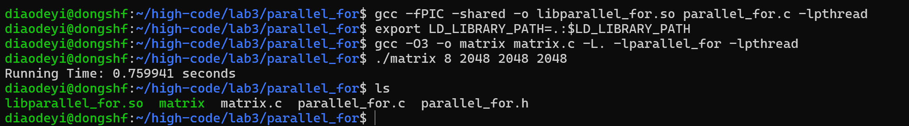

## 构造基于Pthreads的并行for循环分解、分配和执行机制。

### 代码运行

在命令行中编译parallel.c为.so文件，修改环境变量，指定共享库的路径为当前工作目录

```
gcc -fPIC -shared -o libparallel_for.so parallel_for.c -lpthread
export LD_LIBRARY_PATH=.:$LD_LIBRARY_PATH
```
编译matrix.c文件，开启编译优化，并调用parallel_for
```
gcc -O3 -o matrix matrix.c -L. -lparallel_for -lpthread
./matrix 8 2048 2048 2048
```


### 算法原理

基于pthreads的多线程库提供的基本函数，如线程创建、线程join、线程同步等，构建parallel_for函数，该函数实现对循环分解、分配和执行机制，函数参数包括但不限于(int start, int end, int increment, void *(*functor)(void*), void *arg , int num_threads)；其中start为循环开始索引；end为结束索引；increment每次循环增加索引数；functor为函数指针，指向被并行执行的循环代码块；arg为functor的入口参数；num_threads为并行线程数。

在Linux系统中将parallel_for函数编译为.so文件，由其他程序调用。
 
将通用矩阵乘法的for循环，改造成基于parallel_for函数并行化的矩阵乘法，注意只改造可被并行执行的for循环（例如无race condition、无数据依赖、无循环依赖等）。


##### 定义文件parallel_for.h和parallel.c并实现
1、首先定义ThreadData结构体，内部存储每个线程需要用到的信息，其中start、end、increment分别表示循环起始、终止和循环增加索引。

```c
typedef struct {
    int start;
    int end;
    int increment;
    void *(*functor)(void*, int);
    void *arg;
    int thread_id;
    int num_threads;
} ThreadData;
```
2、定义thread_function表示每个线程执行的函数，在thread_function中调用functor，表示循环执行的代码块。

这里需要注意的是代码中两个arg并不相同，void* arg表示线程需要的参数，data->arg表示循环代码块functor需要的参数。

优化：使用轮转调度，每个线程函数中所分配的矩阵行数不同。这样做的目的是减少不必要的循环范围计算，每个线程可以共享同样的start和end。
以increment = 1， num_threads = 8为例，线程0分配的行数为0、8、16...

<font color=blue>并且，此处的循环代码块需要的函数参数不仅仅包括data->arg，还需要每次循环的循环变量i，因此我尝试修改functor的声明，使之成为接受两个参数的函数指针，见上述ThreadData中functor的声明 </font>

```c
void* thread_function(void* arg) {
    ThreadData* data = (ThreadData*) arg;
    for (int i = data->start + data->thread_id * data->increment; i < data->end; i += data->increment * data->num_threads) {
        data->functor(data->arg, i);
    }
    return NULL;
}
```
定义函数parallel_for，实现for循环的并行实现，这里使用pthreads库中的Pthread_create函数来实现线程级并行。

```c
void parallel_for(int start, int end, int increment, void *(*functor)(void*), void *arg, int num_threads) {
    pthread_t* threads = (pthread_t*) malloc(num_threads * sizeof(pthread_t));
    ThreadData* thread_data = (ThreadData*) malloc(num_threads * sizeof(ThreadData));

    // 初始化线程
    for (int i = 0; i < num_threads; i++) {
        thread_data[i].start = start;
        thread_data[i].end = end;
        thread_data[i].increment = increment;
        thread_data[i].functor = functor;
        thread_data[i].arg = arg;
        thread_data[i].thread_id = i;
        thread_data[i].num_threads = num_threads;
        pthread_create(&threads[i], NULL, thread_function, &thread_data[i]);
    }

    for (int i = 0; i < num_threads; i++) {
        pthread_join(threads[i], NULL);
    }

    free(threads);
    free(thread_data);
}
```

